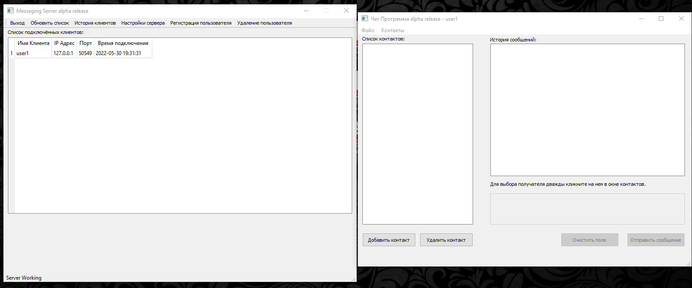

## Проект клиент-серверного приложения

### Описание проекта:

    * Графическая часть выполнена при помощи QTDesigner
    * Реализовано взаимодействие с базой данных через ORM SQLAlchemy
    * Реализовано заимодействие между клиентом и сервером происходит через socket и протокол JIM(JSON instant messaging)
    * Реализовано логирование с сохранением лог файла как клиента так и сервера
    * Реализован прием и отправка сообщений с помощью потоков (threading) в P2P-формате
    * Реализован метод создания ключа на сервере при авторизации клиента

### Запуск проекта:

1. Клонировать репозиторий `https://github.com/basterrus/client_server_chat_pyqt_sqlalchemy.git`
2. Перейти в папке с проектом `CD client_server_chat_pyqt_sqlalchemy`
3. Запустить приложение через:          
   3.1. `launcher.py` - для ОС Windows с графическим интерфейсом       
   3.2. `launcher_ubuntu.py` - для unix ОС с графическим интерфейсом         
   3.3. `python server.py -p 8080 -a 127.0.0.1` - через командную строку с использованием флагов         
   3.4. `python clients.py port 8080 addr 127.0.0.1 -n user1 -p 123456`- через командную строку с использованием флагов    
   
